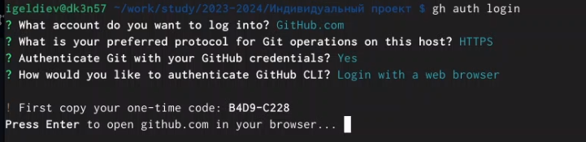
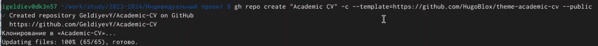
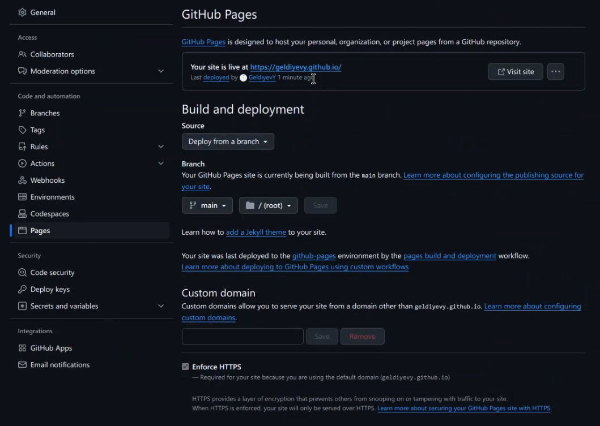

---
## Front matter
lang: ru-RU
title: Индивидуальный проект
subtitle: Этап 1
author:
  - Гелдиев Ыхлас
institute:
  - Российский университет дружбы народов, Москва, Россия
date: 26 мая 2006

## i18n babel
babel-lang: russian
babel-otherlangs: english

## Formatting pdf
toc: false
toc-title: Содержание
slide_level: 2
aspectratio: 169
section-titles: true
theme: metropolis
header-includes:
 - \metroset{progressbar=frametitle,sectionpage=progressbar,numbering=fraction}
---

# Информация

## Докладчик

:::::::::::::: {.columns align=center}
::: {.column width="100%"}

  * Гелдиев Ыхлас
  * студент
  * студент кафедры прикладной информатики
  * Российский университет дружбы народов
  * [1032249184@pfur.ru](mailto:1032249184@pfur.ru)
  * <https://geldiyevy.github.io/ru/>

:::
::::::::::::::

# Вводная часть

## Цель работы

Размещение на Github pages заготовки для персонального сайта.

## Задание

- Установить необходимое программное обеспечение.
- Скачать шаблон темы сайта.
- Разместить его на хостинге git.
- Установить параметр для URLs сайта.
- Разместить заготовку сайта на Github pages.

# Выполнение первого этапа индивидуального проекта

## Установить необходимое программное обеспечение.

Для выполнения нам нужен будет gh. Нужно его скачать и авторизоваться.

{#fig:001}

## Скачать шаблон темы сайта и Разместить его на хостинге git.

Мы можем использовать шаблон темы сайта в качестве шаблона (tamplate) для нашего хостинга.

{#fig:002}

## Установить параметр для URLs сайта.

Если мы назовем наш репозиторий <username>.github.io то GitHub сам установит на него URL для доступа к этому сайти из интеренета

{#fig:003}

## Разместить заготовку сайта на Github pages.

{#fig:004}

## Как мы видим наш сайт уже получил url и мы можем по нему перейти.

{#fig:005}

# Выводы

## Вывод

Я научился размещать на Github pages заготовки для персонального сайта.

