---
## Front matter
lang: ru-RU
title: Лабораторная Работа №1
subtitle: Подготовил
author:
  - Гелдиев Ыхлас
institute:
  - Российский университет дружбы народов, Москва, Россия
date: 26 мая 2006

## i18n babel
babel-lang: russian
babel-otherlangs: english

## Formatting pdf
toc: false
toc-title: Содержание
slide_level: 2
aspectratio: 169
section-titles: true
theme: metropolis
header-includes:
 - \metroset{progressbar=frametitle,sectionpage=progressbar,numbering=fraction}
---

# Информация

## Докладчик

:::::::::::::: {.columns align=center}
::: {.column width="100%"}

  * Гелдиев Ыхлас
  * студент
  * стдент кафедры прикладной информатики
  * Российский университет дружбы народов
  * [1032249184@pfur.ru](mailto:1032249184@pfur.ru)
  * <https://GeldiyevY.github.io/ru/>

:::
::::::::::::::

# Вводная часть

## Цель работы

Целью данной работы является приобретение практических навыков установки операционной системы на виртуальную машину, настройки минимально необходимых для дальнейшей работы сервисов.

## Задание

Установить Fedora Sway на VirtualBox. А так-же настроить его для дальнейшей работы

# Выполнение лабораторной работы

## Создание необходимых каталогов.

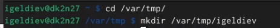{#fig:001}

## Обновления

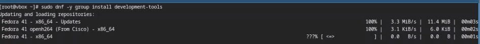{#fig:003}

##

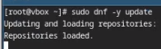{#fig:004}

## Повышение комфорта работы

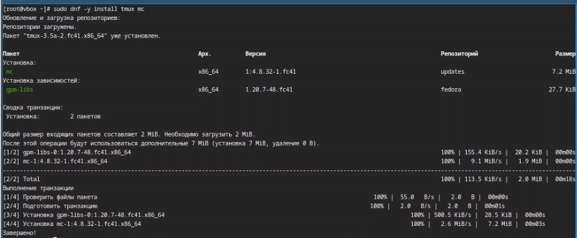{#fig:005}

## Автоматическое обновление

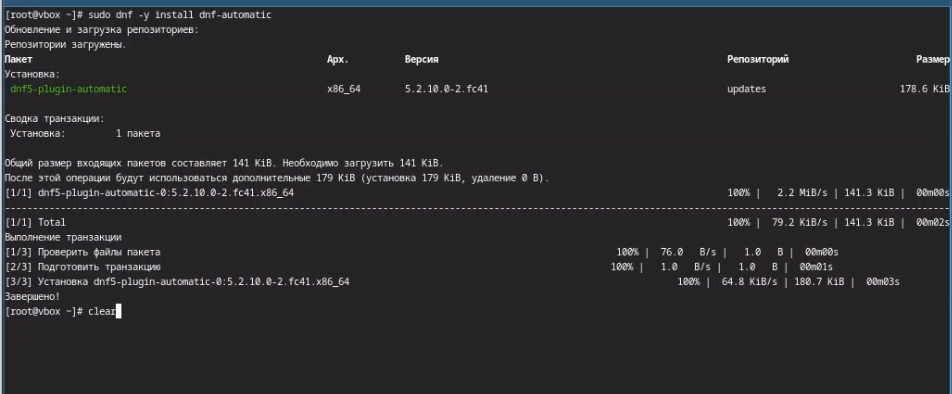{#fig:006}

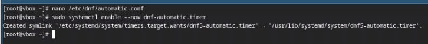{#fig:007}

## Отключение SELinux

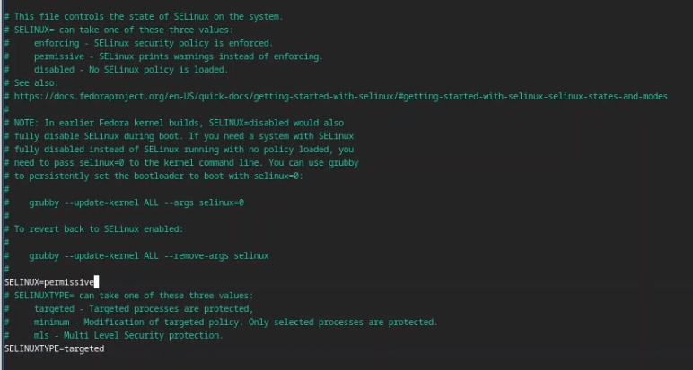{#fig:008}

## Настройка раскладки клавиатуры

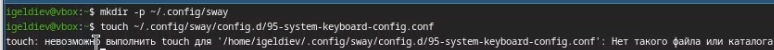{#fig:009}

##

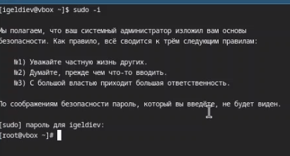{#fig:010}

##

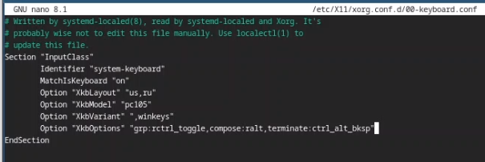{#fig:011}

## Установка программного обеспечения для создания документации

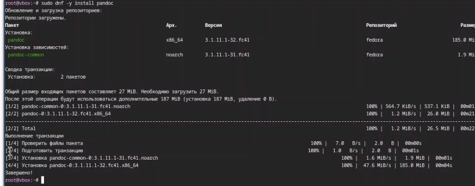{#fig:012}

##

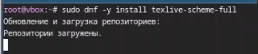{#fig:013}

# Домашнее задание

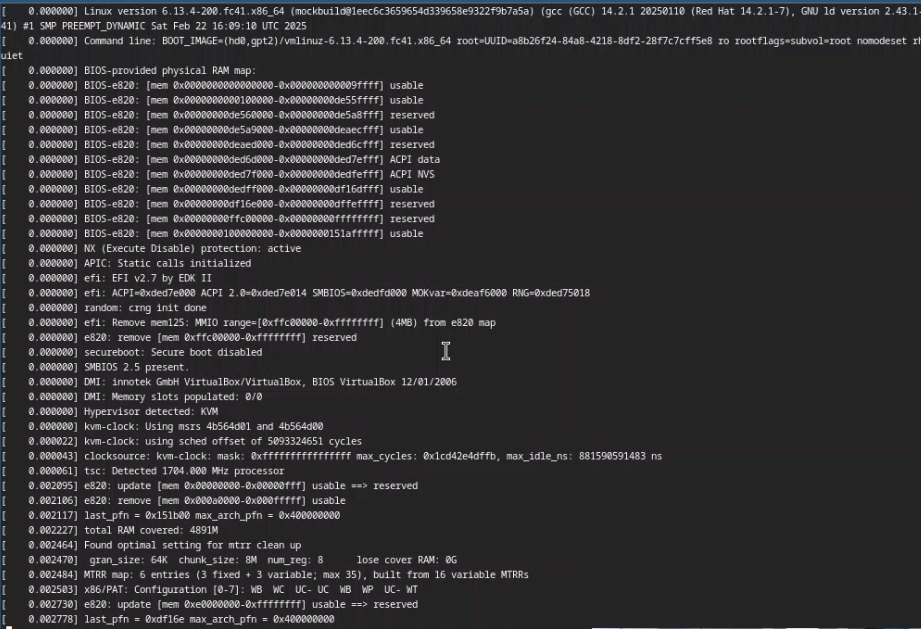{#fig:014}

##

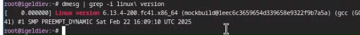{#fig:015}

##

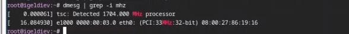{#fig:016}

##

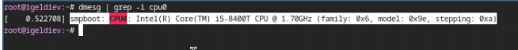{#fig:017}

## 

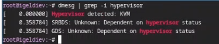{#fig:018}

##

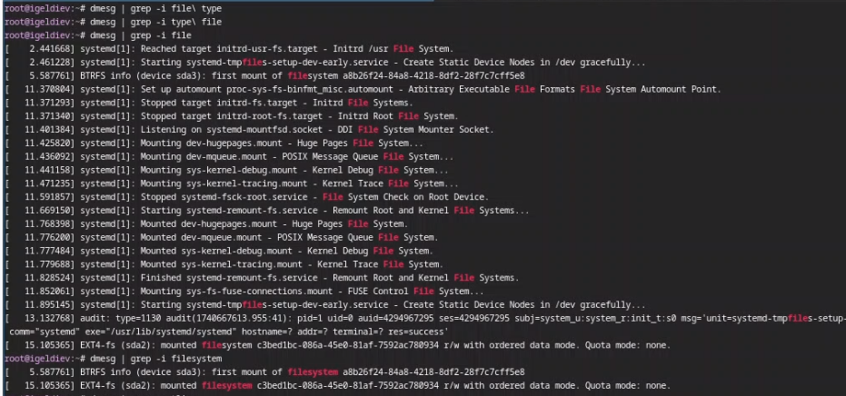{#fig:019}

## Выводы

Я приобрел практические навыки установки операционной системы на виртуальную машину.

