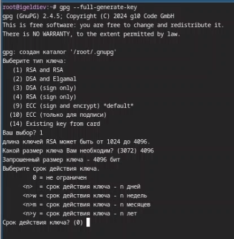
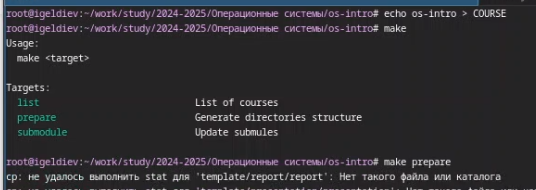

---
## Front matter
lang: ru-RU
title: Лабораторная Работа №2
subtitle: Подготовил
author:
  - Гелдиев Ыхлас
institute:
  - Российский университет дружбы народов, Москва, Россия
date: 26 мая 2006

## i18n babel
babel-lang: russian
babel-otherlangs: english

## Formatting pdf
toc: false
toc-title: Содержание
slide_level: 2
aspectratio: 169
section-titles: true
theme: metropolis
header-includes:
 - \metroset{progressbar=frametitle,sectionpage=progressbar,numbering=fraction}
---

# Информация

## Докладчик

:::::::::::::: {.columns align=center}
::: {.column width="100%"}

  * Гелдиев Ыхлас
  * студент
  * стдент кафедры прикладной информатики
  * Российский университет дружбы народов
  * [1032249184@pfur.ru](mailto:1032249184@pfur.ru)
  * <https://GeldiyevY.github.io/ru/>

:::
::::::::::::::

# Вводная часть

## Цель работы

Изучить идеологию и применение средств контроля версий и освоить умения по работе с git.

## Задание

- Создать базовую конфигурацию для работы с git.
- Создать ключ SSH.
- Создать ключ PGP.
- Настроить подписи git.
- Зарегистрироваться на Github.
- Создать локальный каталог для выполнения заданий по предмету.

# Выполнение лабораторной работы

## Установим git

{#fig:001}

## Установка gh

{#fig:002}

## Установка gh

{#fig:003}

# Базовая настройка git

{#fig:004}

## Создайте ключи ssh

{#fig:005}

## Создайте ключи pgp

{#fig:006}

## Настройка автоматических подписей коммитов git и Настройка gh

{#fig:007}

## Сознание репозитория курса на основе шаблона

{#fig:008}

##

{#fig:009}

## Настройка каталога курса

{#fig:010}

##

{#fig:011}

##

{#fig:012}

## Выводы

В этой лабораторной работе я научился пользоваться git. А так-же настроил каталог курса.

