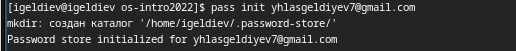
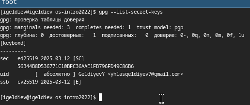
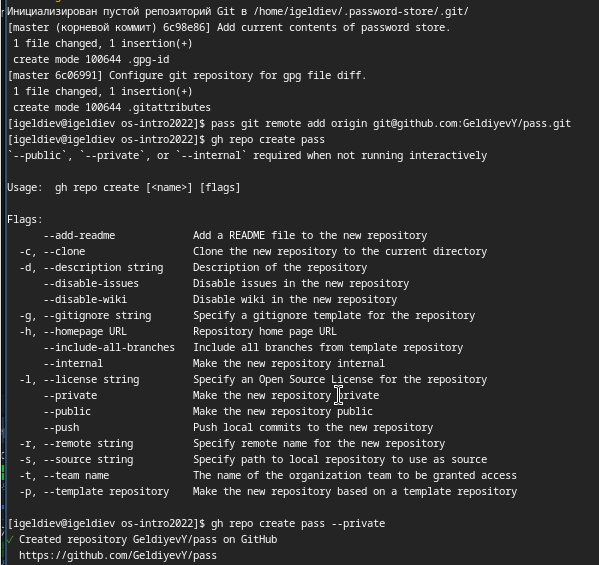
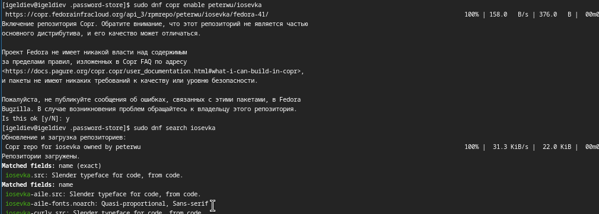
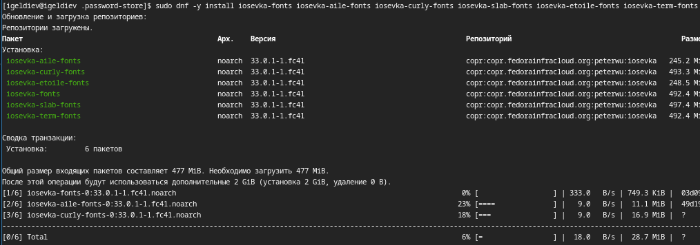
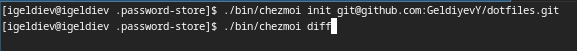
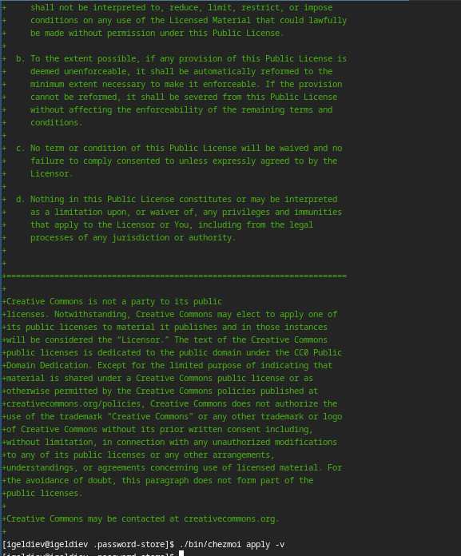

---
## Front matter
lang: ru-RU
title: Лабораторная работа №5
subtitle: Операционные системы
author:
  - Гелдиев Ыхлас
institute:
  - Российский университет дружбы народов, Москва, Россия
date: 25 мая 2006

## i18n babel
babel-lang: russian
babel-otherlangs: english

## Formatting pdf
toc: false
toc-title: Содержание
slide_level: 2
aspectratio: 169
section-titles: true
theme: metropolis
header-includes:
 - \metroset{progressbar=frametitle,sectionpage=progressbar,numbering=fraction}
---

# Информация

## Докладчик

:::::::::::::: {.columns align=center}
::: {.column width="100%"}

  * Гелдиев Ыхлас
  * студент
  * студент кафедры прикладной информатики и теории вероятностей
  * Российский университет дружбы народов
  * [1032249184@pfur.ru](mailto:1032249184@pfur.ru)
  * <https://geldiyevy.github.io/>

:::
::::::::::::::

# Вводная часть

## Цель работы

Настройка рабочей среды.

## Задание

Настроить рабочую среду.

# Выполнение лабораторной работы

## Установка Менеджер паролей pass

##

## Настройка

##

## Настройка интерфейса с броузером

## Управление файлами конфигурации

##

##

## Подключение репозитория к своей системе

##

# Выводы

## Вывод

Мы смогли настроить нашу систему для дальнейшей работы.

