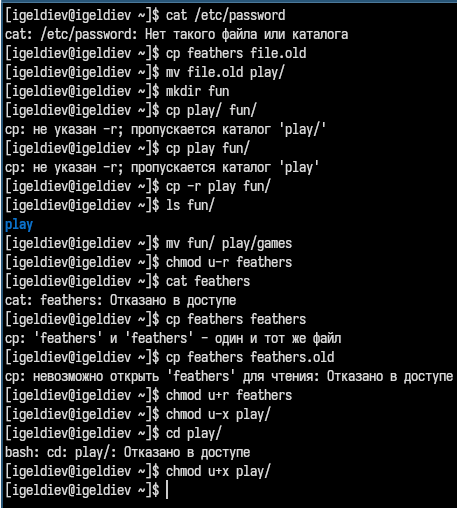

---
## Front matter
lang: ru-RU
title: Лабораторная работа №7
subtitle: Подготовил
author:
  - Гелдиев Ыхлас
institute:
  - Российский университет дружбы народов, Москва, Россия
date: 26 мая 2006

## i18n babel
babel-lang: russian
babel-otherlangs: english

## Formatting pdf
toc: false
toc-title: Содержание
slide_level: 2
aspectratio: 169
section-titles: true
theme: metropolis
header-includes:
 - \metroset{progressbar=frametitle,sectionpage=progressbar,numbering=fraction}
---

# Информация

## Докладчик

:::::::::::::: {.columns align=center}
::: {.column width="100%"}

  * Гелдиев Ыхлас
  * студент
  * студент группы НПИбд-03-24 по направлению Прикладная информатика
  * Российский университет дружбы народов
  * [1032249184@pfur.ru](mailto:1032249184@pfur.ru)
  * <https://geldiyevy.github.io/>

:::
::::::::::::::

# Вводная часть

## Цель работы

Ознакомление с файловой системой Linux, её структурой, именами и содержанием каталогов. Приобретение практических навыков по применению команд для работы с файлами и каталогами, по управлению процессами (и работами), по проверке использования диска и обслуживанию файловой системы.

# Выполнение лабораторной работы

## Выполните все примеры, приведённые в первой части описания лабораторной работы. Копирование файлов и каталогов

{#fig:001}

## Перемещение и переименование файлов и каталогов

{#fig:002}

## Изменение прав доступа

{#fig:003}

## Анализ файловой системы

{#fig:004}

## Выполните следующие действия, зафиксировав в отчёте по лабораторной работе используемые при этом команды и результаты их выполнения

{#fig:005}

## Определите опции команды chmod, необходимые для того, чтобы присвоить перечисленным ниже файлам выделенные права доступа, считая, что в начале таких прав нет.

{#fig:006}

## Проделайте приведённые ниже упражнения, записывая в отчёт по лабораторной работе используемые при этом команды

{#fig:007}

## Прочитайте man по командам mount, fsck, mkfs, kill

{#fig:008}

# Выводы

## Вывод

Я ознакомился с файловой системой Linux, её структурой, именами и содержанием каталогов. Также я приобрел практические навыки по применению команд для работы с файлами и каталогами, по управлению процессами (и работами), по проверке использования диска и обслуживанию файловой системы.
